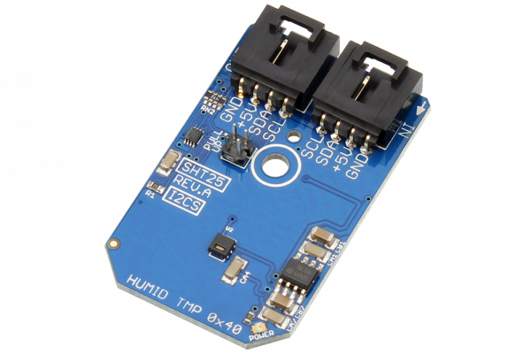

# SHT25

The SHT25 high-accuracy humidity and temperature sensor (from Sensirion) has become an industry standard in terms of form factor and intelligence, providing calibrated, linearized sensor signals in digital, I2C format.
This Device is available from www.ncd.io 

[SKU: SHT25_I2CS]

(https://store.ncd.io/product/sht25-humidity-and-temperature-sensor-%C2%B11-8rh-%C2%B10-2c-i2c-mini-module/)
This Sample code can be used with Arduino.

Hardware needed to interface SHT25 sensor with Arduino

1. <a href="https://store.ncd.io/product/i2c-shield-for-arduino-nano/">Arduino Nano</a>

2. <a href="https://store.ncd.io/product/i2c-shield-for-arduino-micro-with-i2c-expansion-port/">Arduino Micro</a>

3. <a href="https://store.ncd.io/product/i2c-shield-for-arduino-uno/">Arduino uno</a>

4. <a href="https://store.ncd.io/product/dual-i2c-shield-for-arduino-due-with-modular-communications-interface/">Arduino Due</a>

5. <a href="https://store.ncd.io/product/sht25-humidity-and-temperature-sensor-%C2%B11-8rh-%C2%B10-2c-i2c-mini-module/">SHT25 Temperature and humidity Sensor</a>

6. <a href="https://store.ncd.io/product/i%C2%B2c-cable/">I2C Cable</a>

SHT25:

The SHT25 high-accuracy humidity and temperature sensor (from Sensirion) has become an industry standard in terms of form factor and intelligence, providing calibrated, linearized sensor signals in digital, I2C format.

Applications:

• Temperature monitoring.

• Computer peripheral thermal protection.

• Weather station applications

How to Use the SHT25 Arduino Library

The SHT25 has a number of settings, which can be configured based on user requirements.
          
1.Address calling:The following command is used to call the SHT25 sensor to begin the transmission.

          sht.getAddr_SHT25(SHT25_DEFAULT_ADDRESS);   // 0x40
            
2.Resolution setup:The following command is used to set the resolution.

          sht.setResolution(RESOLUTION_0);             // RH: 12 bit, Temp: 14 bit
             
3.Voltage setup:The following command is used to set the voltage.             
             
           sht.setVoltage(VOLTAGE_OK);                  // VDD OK       

4.Heater status:The following command is used to ENABLE the heater.

          sht.setHeaterStatus(HEATER_ENABLE);          // On-chip Heater Enable
             
5.OTP status:The following command is used to DISABLE the OTP.        
             
          sht.setOTPStatus(OTP_DISABLE);               // OTP Reload Disable
             
6.Temperature mode:The following command is used to measure temperature in NO HOLD master mode.             
             
          sht.setTempMode(TEMP_NO_HOLD);               // Measure Temperature, No Hold Master Mode   
           
7.Humidity mode:The following command is used to measure humidity in NO HOLD master mode.             
             
          sht.setHumidityMode(HUMIDITY_NO_HOLD);       // Measure Humidity, No Hold Master Mode
          
